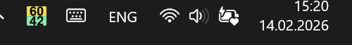
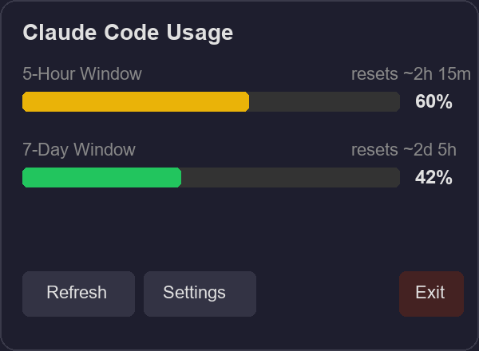

# Claude Tracker

Windows system tray widget that shows your Claude Code usage limits (5-hour and 7-day) in real-time.



The icon sits in your notification area (like the keyboard or language icons) and shows both limits at a glance — top half is 5-hour, bottom half is 7-day. Colors indicate usage level: green (<50%), yellow (50-80%), pink/red (>80%).

Click the icon to see a detailed popup:



## Install

### Option 1: Download .exe (recommended)

1. Go to [Releases](../../releases) and download `ClaudeTracker.exe`
2. Run it — the icon appears in your notification area
3. If the icon is hidden in the overflow (^), right-click the taskbar → **Taskbar settings** → **Other system tray icons** → enable **ClaudeTracker**

### Option 2: Run from source

Requires [uv](https://docs.astral.sh/uv/) and Python 3.12+.

```
git clone https://github.com/user/claude-tracker.git
cd claude-tracker
uv run python -m claude_tracker
```

## Prerequisites

You must be logged into Claude Code — the app reads your OAuth token from `~/.claude/.credentials.json`.

## Features

- **Split tray icon** — 5H (top) and 7D (bottom) with color-coded backgrounds and percentage numbers
- **Auto-pin** — automatically promotes the icon to always-visible in the notification area
- **Popup flyout** — click the icon for detailed usage bars, reset timers, refresh/settings/exit
- **Tooltip** — hover the icon to see `Claude: 5H 60% | 7D 42%`
- **Auto-refresh** — polls usage every 60 seconds (configurable)
- **Start on boot** — optional Windows startup via registry
- **Settings** — refresh interval, start on boot

## Build .exe

```
uv add pyinstaller --dev
uv run pyinstaller build.spec
```

The output is `dist/ClaudeTracker.exe` — a single standalone file, no install needed.

## Settings

Stored at `~/.claude/tracker-settings.json`:

```json
{
  "refresh_interval": 60,
  "start_on_boot": false,
  "theme": "dark"
}
```

## How it works

Reads the OAuth token from `~/.claude/.credentials.json` and calls `GET https://api.anthropic.com/api/oauth/usage` with the `anthropic-beta: oauth-2025-04-20` header. Automatically refreshes expired tokens.
